# Projektdokumentation - Deadline Planner

## Inhaltsverzeichnis

1. [Ausgangslage](#1-ausgangslage)
2. [Lösungsidee](#2-lösungsidee)
3. [Vorgehen & Artefakte](#3-vorgehen--artefakte)
   1. [Understand & Define](#31-understand--define)
   2. [Sketch](#32-sketch)
   3. [Decide](#33-decide)
   4. [Prototype](#34-prototype)
   5. [Validate](#35-validate)
4. [Erweiterungen](#4-erweiterungen)
   1. [Login & Registrierung mit Rollenverwaltung](#41-login--registrierung-mit-rollenverwaltung)
   2. [Admin-Panel – Benutzerverwaltung](#42-admin-panel--benutzerverwaltung)
   3. [Tagesplanung / Workload-Rechner](#43-tagesplanung--workload-rechner)
   4. [Modulübersicht](#44-modulübersicht)
   5. [Statistik-Dashboard](#45-statistik-dashboard)
   6. [Kalenderansicht (Woche & Monat)](#46-kalenderansicht-woche--monat)
   7. [KI-Assistent (Floating Widget)](#47-ki-assistent-floating-widget)
   8. [Benachrichtigungs-Glocke](#48-benachrichtigungs-glocke)
   9. [E-Mail-Benachrichtigungen](#49-e-mail-benachrichtigungen)
   10. [Hell/Dunkel-Modus](#410-helldunkel-modus)
   11. [Einstellungsseite](#411-einstellungsseite)
   12. [Archiv](#412-archiv)
   13. [iCal- & CSV-Export](#413-ical---csv-export)
5. [Projektorganisation](#5-projektorganisation)
6. [KI-Deklaration](#6-ki-deklaration)
7. [Anhang](#7-anhang)

---

## 1. Ausgangslage

- **Problem:** Ein zentraler Problemraum im Alltag von Studierenden liegt im Umgang mit Deadlines und Abgaben. Viele Studierende haben Schwierigkeiten, den Überblick über verschiedene Fristen in unterschiedlichen Modulen zu behalten. Aufgaben werden teilweise zu spät begonnen oder sogar vergessen, was zu Stress und schlechteren Leistungen führt.

  Ein weiteres Problem besteht darin, dass Deadlines oft nur als fixe Termine wahrgenommen werden, ohne eine sinnvolle Planung der dafür benötigten Arbeitszeit. Studierende wissen zwar, wann etwas abgegeben werden muss, jedoch nicht, wann sie effektiv damit beginnen sollten.

  Zudem fehlt häufig eine Priorisierung der Aufgaben. Wenn mehrere Deadlines gleichzeitig anstehen, fällt es schwer zu entscheiden, welche Aufgaben zuerst erledigt werden sollen. _(Beispiel: Ein Student hat gleichzeitig eine Seminararbeit, ein Gruppenreferat und eine Online-Prüfung – er verliert den Überblick, wann er mit welcher Aufgabe beginnen soll.)_

- **Ziele:**
  - Kostenlose Webapplikation zur zentralen Verwaltung aller Studien-Deadlines
  - Automatische Berechnung des täglichen Arbeitsaufwands pro Deadline
  - Priorisierung von Aufgaben (hoch / mittel / niedrig) mit farblicher Kennzeichnung
  - Status-Tracking pro Deadline (Offen / In Bearbeitung / Erledigt)
  - Visuelle Warnungen bei nahenden oder überfälligen Deadlines
  - Benutzerregistrierung mit persönlichem Konto und Rollenverwaltung
  - KI-gestützter Assistent für individuelle Tagesplanung und Priorisierungsempfehlungen

- **Primäre Zielgruppe:** Studierende im Alter von 18–30 Jahren, die mehrere Module parallel besuchen und regelmässig Aufgaben, Projekte und Prüfungen abgeben müssen. Die Anwendung richtet sich insbesondere an Personen, die neben dem Studium noch einem Nebenjob nachgehen und ihr Zeitbudget effizient einteilen müssen.

- **Weitere Stakeholder:**
  - _Dozierende:_ Könnten die Plattform zur Übersicht über Abgabeverhalten nutzen
  - _Studiengangskoordinatoren:_ Könnten aggregierte Semesterplanungen einsehen

---

## 2. Lösungsidee

Deadline Planner ist eine kostenlose, webbasierte Applikation, die Studierenden ermöglicht, ihre Abgaben und Prüfungen zentral zu verwalten, den benötigten Arbeitsaufwand pro Tag zu planen und nie wieder eine wichtige Deadline zu verpassen.

- **Kernfunktionalität:** Die App deckt vier zentrale Workflows ab:
  1. **Deadline erfassen:** Neue Deadline → Titel, Modul, Datum, Aufwand, Priorität und Typ eingeben → Speichern → erscheint sofort in der Übersicht
  2. **Tagesplanung prüfen:** Login → Tagesplanung → automatische Berechnung h/Tag → Tagesziel sichtbar, gruppiert nach Dringlichkeit
  3. **Fortschritt tracken:** Deadline öffnen → Status anpassen (Offen / In Bearbeitung / Erledigt) → Fortschritt in % setzen → Archiv bei Erledigung
  4. **KI-Assistent befragen:** Floating Button öffnen → Frage stellen (z.B. «Erstelle mir einen Tagesplan für heute») → personalisierte Antwort basierend auf echten Deadlines

- **Annahmen:**
  - Studierende sind bereit, Deadlines einmalig manuell einzutragen, wenn der Aufwand gering und die Oberfläche intuitiv ist
  - Eine automatische Berechnung des täglichen Arbeitsaufwands reduziert das Aufschieben von Aufgaben
  - Eine klare Visualisierung von Priorität und verbleibenden Tagen reicht als tägliche Rückmeldung aus
  - Ein integrierter KI-Assistent mit Zugang zu den echten Deadlines ist wertvoller als generische Planungstools

- **Abgrenzung:**
  - Keine automatische Synchronisation mit Moodle oder anderen Lernplattformen
  - Kein integrierter Chat oder Kollaborationsfunktionen für Gruppenarbeiten
  - Keine mobile App (iOS/Android), reine Webapplikation
  - Keine Push-Benachrichtigungen – E-Mail-Benachrichtigungen nur auf Wunsch des Users

---

## 3. Vorgehen & Artefakte

### 3.1 Understand & Define

#### Zielgruppenverständnis

**Problemraumanalyse**

Viele Studierende verlassen sich auf Moodle-Kalender oder handschriftliche Notizen, um Deadlines zu verfolgen. Diese Lösungen bieten jedoch keine aktive Unterstützung bei der Planung. Bestehende Apps wie Todoist oder Google Tasks decken zwar allgemeine Aufgabenverwaltung ab, bieten jedoch keine auf Studierende ausgerichtete Funktionalität wie automatische Aufwandsverteilung oder modulbezogene Übersichten.

Die Recherche zeigt, dass das Kernproblem nicht das Vergessen von Deadlines ist, sondern das fehlende Bewusstsein, wann mit einer Aufgabe begonnen werden muss. Eine Deadline in zwei Wochen mit 10 Stunden Aufwand erfordert, heute zu beginnen – das zeigen bestehende Lösungen nicht. Hinzu kommt, dass bei mehreren gleichzeitigen Deadlines keine intelligente Priorisierungshilfe vorhanden ist.

---

**Proto-Persona 1 – Der überforderte Vollzeit-Student**

|                 |                                                                             |
| --------------- | --------------------------------------------------------------------------- |
| **Name**        | Luca, 21 Jahre                                                              |
| **Situation**   | Bachelorstudent Wirtschaftsinformatik, 6 Module pro Semester, kein Nebenjob |
| **Ziel**        | Alle Deadlines rechtzeitig erledigen, Stress vor Abgabeterminen reduzieren  |
| **Frustration** | Merkt erst 2 Tage vor der Abgabe, wie viel Arbeit noch aussteht             |
| **Bedürfnis**   | Frühzeitige Warnung, klare Tagesplanung, Priorisierungshilfe                |

---

**Proto-Persona 2 – Die berufstätige Teilzeit-Studentin**

|                 |                                                                                               |
| --------------- | --------------------------------------------------------------------------------------------- |
| **Name**        | Nina, 26 Jahre                                                                                |
| **Situation**   | Studiert berufsbegleitend, 40% Pensum neben dem Studium                                       |
| **Ziel**        | Studium und Beruf vereinbaren, Deadlines nicht vergessen                                      |
| **Frustration** | Hat wenig Zeit und weiss nicht, wie sie die verbleibende Zeit auf die Aufgaben verteilen soll |
| **Bedürfnis**   | Schnelle Übersicht, Aufwandsberechnung pro Tag, mobil zugänglich                              |

---

#### Wesentliche Erkenntnisse

- Studierende wollen **auf einen Blick** sehen, welche Aufgaben dringend sind – eine klare Farbkodierung ist essenziell
- **Automatische Aufwandsverteilung** wird als wertvoller empfunden als reine Deadline-Listen
- Der **Einstieg in die App** muss reibungslos sein – zu viele Pflichtfelder bei der Registrierung schrecken ab
- Studierende wollen **Module trennen** können, um den Gesamtaufwand pro Fach zu verstehen
- Eine **Verbindung zwischen Deadline und konkretem Tagesplan** wird als fehlend in bestehenden Lösungen identifiziert
- **Überfällige Deadlines** sollen sofort erkennbar sein – visuelle Warnungen mit Farbe sind essenziell
- Ein **KI-Assistent** der die echten Deadlines kennt, wird als deutlich hilfreicher bewertet als generische Planungsratschläge

---

### 3.2 Sketch

#### Variantenüberblick

Im Sketch-Schritt wurden konzeptionelle Varianten für das Layout und die Hauptinteraktion des Deadline Planners skizziert. Ziel war es, unterschiedliche Ansätze für die Navigation und den zentralen Workflow (Deadline erfassen → Tagesplan sehen) zu evaluieren.

|                          | Variante A                                        | Variante B                            | Variante C                            |
| ------------------------ | ------------------------------------------------- | ------------------------------------- | ------------------------------------- |
| **Konzept**              | Dashboard-zentriert                               | Liste-First                           | Kalender-First                        |
| **Startseite**           | Übersichtsdashboard mit Warnungen und Statistiken | Direkte Deadline-Liste als Startseite | Monatskalender als Einstieg           |
| **Navigation**           | Zweistufige Navbar (Top + Tabs)                   | Sidebar-Navigation                    | Bottom-Navigation (mobil)             |
| **Deadline-Darstellung** | Farbkodierte Tabelle mit Badges                   | Karten-Layout                         | Kalender-Punkte                       |
| **Stärke**               | Guter Gesamtüberblick, viele Infos auf einmal     | Schneller Zugriff auf Deadlines       | Zeitliche Einordnung sofort sichtbar  |
| **Schwäche**             | Viel Information auf einmal                       | Keine Priorisierungsübersicht         | Aufwandsplanung nicht direkt sichtbar |

#### Skizzen

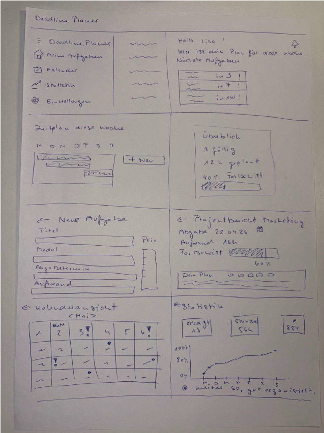

_Startseite: Übersicht aller Deadlines mit Statistik-Karten und Warnungen._
_Wochenplan: Automatische Berechnung des täglichen Arbeitsaufwands pro Deadline._
_Neue Deadline erfassen: Formular mit den wichtigsten Feldern wie Titel, Modul und Datum._
_Kalenderansicht: Wochen- und Monatsansicht aller Deadlines._
_Statistik: Visuelle Auswertung von Aufwand, Status und Priorität aller Deadlines._

---

### 3.3 Decide

**Entscheid:** Variante A wurde als Grundlage gewählt, ergänzt mit der Kalenderansicht aus Variante C als separate Seite. Das Dashboard aus Variante A bietet die beste Übersicht und gibt Studierenden beim Öffnen der App sofort die wichtigsten Informationen.

**Entscheidkriterien:**

| Kriterium                           | Variante A             | Variante B     | Variante C              |
| ----------------------------------- | ---------------------- | -------------- | ----------------------- |
| **Gesamtüberblick auf einen Blick** | ✅ Stark               | ⚠️ Nur Liste   | ❌ Nur Termine          |
| **Einstieg für Neulinge**           | ✅ Klar & strukturiert | ✅ Einfach     | ⚠️ Mittel               |
| **Priorisierung sichtbar**          | ✅ Direkt              | ⚠️ Mittel      | ❌ Nicht sichtbar       |
| **Desktop & Mobile**                | ✅ Zweistufige Navbar  | ⚠️ Sidebar eng | ⚠️ Bottom-Nav nur mobil |
| **Erweiterbarkeit**                 | ✅ Gut                 | ⚠️ Mittel      | ⚠️ Mittel               |
| **Umsetzbarkeit**                   | ✅ Realistisch         | ✅ Realistisch | ⚠️ Aufwändig            |

**Begründung:** Variante A überzeugt durch die ausgewogene Balance zwischen Überblick und Erreichbarkeit aller Funktionen. Das Dashboard zeigt beim Öffnen der App sofort die wichtigsten Informationen (überfällige Deadlines, Wochenziel, Gesamtaufwand) ohne Scrollen. Die zweistufige Navbar mit oberer Leiste (Logo, Aktionen, User) und unterer Tab-Leiste (Navigation) ist von professionellen Tools wie Notion oder Linear bekannt und minimiert die Lernkurve.

---

**End-to-End-Ablauf:**

| Schritt | Seite           | Aktion                                                | Nutzerziel                                    |
| ------- | --------------- | ----------------------------------------------------- | --------------------------------------------- |
| 1       | `/login`        | Registrieren oder Einloggen                           | Zugang zur App erhalten                       |
| 2       | `/`             | Dashboard prüfen – Warnungen und Statistiken sehen    | Verstehen, welche Deadlines dringend sind     |
| 3       | `/neu`          | Neue Deadline erfassen (Titel, Modul, Datum, Aufwand) | Abgabe in der App registrieren                |
| 4       | `/tagesplanung` | Automatische h/Tag-Berechnung einsehen                | Wissen, wie viel heute gearbeitet werden muss |
| 5       | `/`             | Status einer Deadline anpassen (In Bearbeitung)       | Fortschritt dokumentieren                     |
| 6       | `/statistik`    | Aufwand pro Modul und Statusverteilung analysieren    | Semesterplanung optimieren                    |
| 7       | KI-Widget       | KI-Assistenten öffnen und Tagesplan anfragen          | Personalisierte Empfehlung erhalten           |

**User Journey Map (SOLL) – «Einen Tag mit dem Deadline Planner»**

|                 | 1) Login & Start                                         | 2) Deadline erfassen                       | 3) Tagesplanung prüfen                 | 4) KI-Assistent befragen                         |
| --------------- | -------------------------------------------------------- | ------------------------------------------ | -------------------------------------- | ------------------------------------------------ |
| **Ziel**        | Zugang erhalten und Überblick gewinnen                   | Neue Abgabe registrieren                   | Wissen, wie viel heute zu tun ist      | Personalisierte Empfehlung erhalten              |
| **Aktionen**    | App öffnen → Login → Dashboard lädt → Warnungen sichtbar | /neu öffnen → Felder ausfüllen → Speichern | /tagesplanung → h/Tag-Berechnung lesen | KI-Widget öffnen → Frage stellen → Antwort lesen |
| **Touchpoints** | Login-Seite, Dashboard                                   | Formularseite /neu                         | Tagesplanung-Seite                     | Floating KI-Chat-Widget                          |
| **Emotion**     | Orientierung & Überblick                                 | Kontrolle & Struktur                       | Klarheit & Motivation                  | Entlastung & Effizienz                           |
| **Risiko**      | Dashboard überladen                                      | Zu viele Pflichtfelder                     | Berechnung unklar                      | KI gibt generische Antworten                     |
| **Mitigation**  | Klare Karten mit Farbkodierung                           | Minimale Pflichtfelder                     | Erklärungstext bei h/Tag               | KI kennt echte Deadlines des Users               |

**Mockup:** [Figma Mockup – Deadline Planner](https://www.figma.com/design/LEyjt3Ir9PwxXuDjK9TyFG/Deadline-Planner-Mockup?node-id=0-1&p=f&t=h5NKSlflyNY1SQ3w-0)

---

**Screenshot 1 – Übersicht / Dashboard**

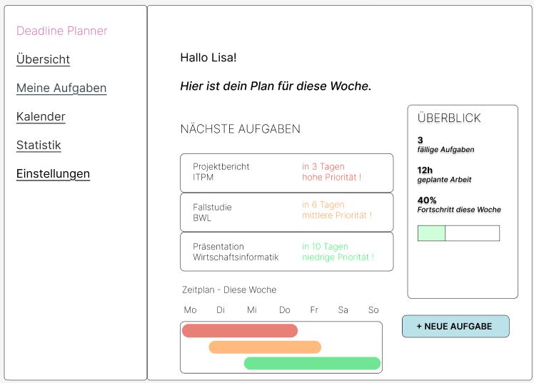

Die Übersichtsseite zeigt die nächsten anstehenden Aufgaben,
einen kleinen Zeitplan sowie einen groben Gesamtüberblick
aller Deadlines. Über einen Button kann direkt eine neue
Aufgabe erfasst werden.

---

**Screenshot 2 – Neue Deadline erfassen**

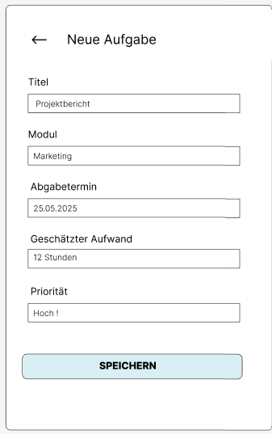

Das Formular ermöglicht das Erfassen einer neuen Deadline mit allen
relevanten Feldern: Titel, Modul, Datum, geschätzter Aufwand in
Stunden und Priorität.

---

**Screenshot 3 – Kalenderansicht**

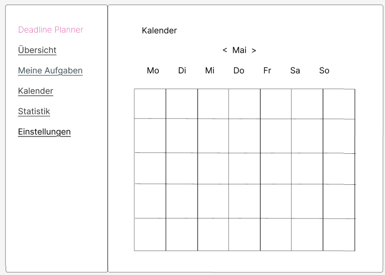

Die Kalenderansicht zeigt alle Deadlines in einer Wochen- oder
Monatsansicht. Mit den Pfeiltasten kann zwischen Wochen
bzw. Monaten navigiert werden. Leere Tage werden
ebenfalls angezeigt.

---

**Screenshot 4 – Modulübersicht**

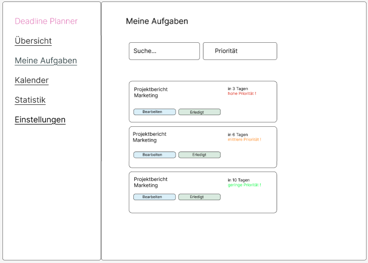

Die Modulübersicht gruppiert alle Deadlines nach Modul und zeigt
pro Fach die noch ausstehenden Aufgaben sowie deren Priorität.
Jede Aufgabe kann direkt bearbeitet oder als erledigt markiert werden.

---

**Screenshot 5 – Statistik**

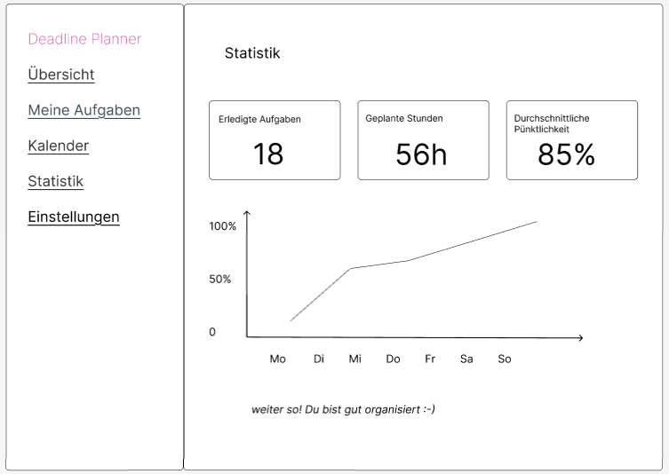

Die Statistikseite visualisiert den Fortschritt mit einem
Liniendiagramm, zeigt die Anzahl erledigter Aufgaben,
die geplanten Stunden sowie die durchschnittliche Pünktlichkeit
bei Abgaben.

---

### 3.4 Prototype

#### 3.4.1. Entwurf (Design)

##### Informationsarchitektur

Der Deadline Planner ist als flache Navigation aufgebaut. Alle Hauptseiten sind direkt über die Tab-Leiste erreichbar. Das Ziel war eine klare Hierarchie mit minimalem Navigationsaufwand.

**Seitenstruktur & Navigation:**

```
Deadline Planner
├── Landingpage (/)                  → Einstieg für nicht eingeloggte User mit Feature-Preview
├── Übersicht (/ nach Login)         → Dashboard mit Deadlines, Warnungen, Statistik-Karten
│   └── Deadline bearbeiten (/bearbeiten/[id])
├── Neue Deadline (/neu)             → Formular zum Erfassen einer Deadline
├── Tagesplanung (/tagesplanung)     → Automatische Aufwandsberechnung h/Tag
├── Kalender (/kalender)             → Wochen- und Monatsansicht aller Deadlines
├── Module (/module)                 → Deadlines nach Modul gruppiert mit Fortschritt
├── Statistik (/statistik)           → Charts: Aufwand, Status, Priorität + Export
├── Archiv (/archiv)                 → Erledigte Deadlines separat
├── Einstellungen (/einstellungen)   → Profil, Benachrichtigungen, Navigation, Defaults
├── Admin (/admin)                   → Benutzerverwaltung (nur Admin-Rolle)
├── Login (/login)                   → Authentifizierung & Registrierung
└── Logout (/logout)                 → Session beenden, Weiterleitung zu /login
```

**Navigationskonzept:**

- **Obere Leiste:** Logo, Benachrichtigungs-Glocke, Hell/Dunkel-Toggle, «+ Neue Deadline»-Button, User-Dropdown (Einstellungen, Admin, Abmelden)
- **Tab-Leiste:** Übersicht, Tagesplanung, Kalender, Module, Statistik, Archiv (konfigurierbar in Einstellungen)
- **Floating Widget:** KI-Assistent immer sichtbar rechts unten, unabhängig von der aktuellen Seite
- Admin-Link erscheint nur für Benutzer mit der Rolle «admin»

---

##### User Interface Design

---

**Screen 1 – Übersicht (`/`)**

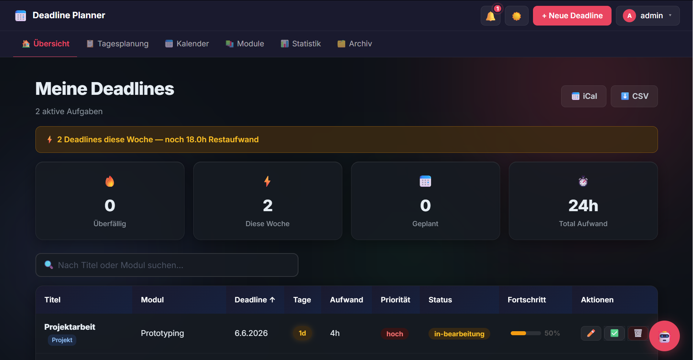

Die Übersichtsseite ist das zentrale Dashboard der App. Sie zeigt oben
vier Statistik-Karten mit einem schnellen Überblick über überfällige,
diese Woche fällige, geplante Deadlines sowie den gesamten Aufwand in
Stunden. Darunter befindet sich eine farbkodierte Tabelle aller Deadlines
mit Titel, Modul, Fälligkeitsdatum, verbleibenden Tagen, Aufwand,
Priorität und Status. Überfällige Einträge sind rot, kritische orange
hervorgehoben. Erledigte Deadlines erscheinen durchgestrichen.

> _Designentscheid:_ Die Farbkodierung der Zeilen gibt sofortige visuelle
> Rückmeldung über die Dringlichkeit, ohne dass Nutzende Zahlen lesen müssen.

---

**Screen 2 – Tagesplanung (`/tagesplanung`)**

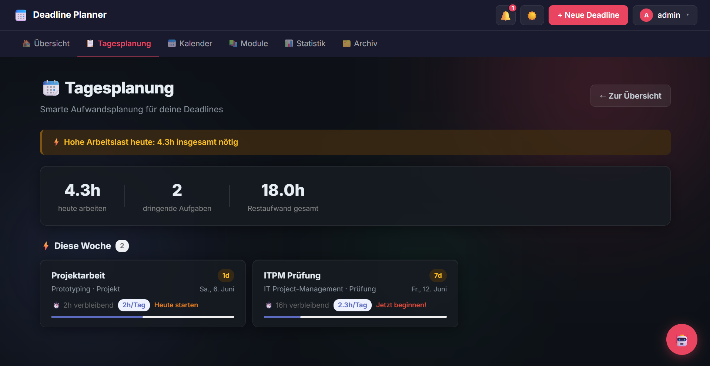

Die Tagesplanung berechnet automatisch für jede offene Deadline, wie
viele Stunden pro Tag benötigt werden (Aufwand ÷ verbleibende Tage).
Die Deadlines sind nach Dringlichkeit gruppiert (Heute, Diese Woche,
Später). Eine Tagesziel-Card zeigt den aggregierten Gesamtaufwand
für den heutigen Tag, damit Studierende wissen wie viel Zeit sie
einplanen müssen.

> _Designentscheid:_ Die Tagesplanung löst das Kernproblem direkt:
> Studierende wissen nicht nur wann, sondern auch wie viel sie
> täglich arbeiten müssen.

---

**Screen 3 – Kalenderansicht (`/kalender`)**

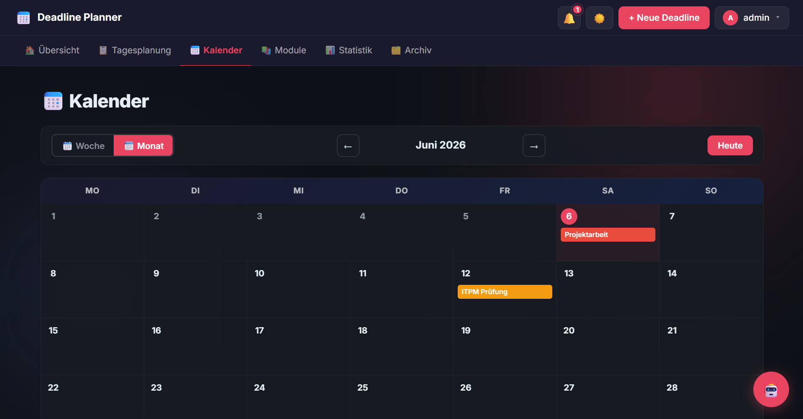

Der Kalender bietet eine Wochen- und Monatsansicht aller Deadlines.
Mit Pfeiltasten kann zwischen Wochen bzw. Monaten navigiert werden,
ein «Heute»-Button springt zurück zum aktuellen Zeitraum. Alle Tage
werden angezeigt, auch leere. Deadlines erscheinen als farbige Badges
je nach Priorität.

> _Designentscheid:_ Auch leere Tage werden angezeigt, damit Nutzende
> freie Zeitfenster für die Planung erkennen können.

---

**Screen 4 – Modulübersicht (`/module`)**

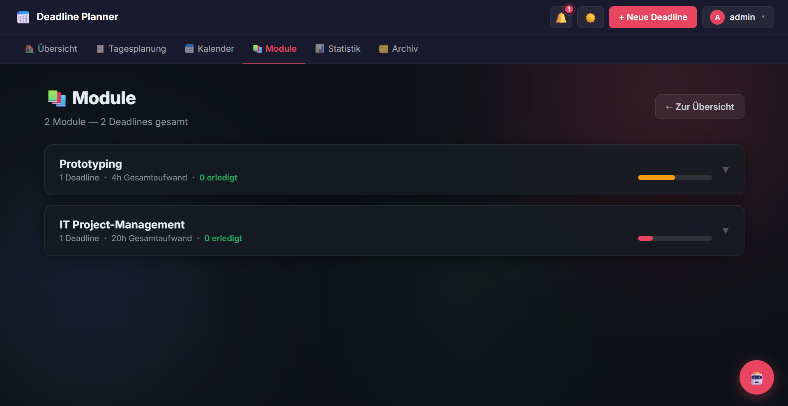

Die Modulübersicht gruppiert alle Deadlines nach Modul und zeigt pro
Fach die Anzahl offener Aufgaben, den Gesamtaufwand in Stunden sowie
einen Fortschrittsbalken mit dem Anteil erledigter Aufgaben. So ist
auf einen Blick erkennbar, welches Modul am meisten Aufmerksamkeit
benötigt. Jede Deadline kann direkt bearbeitet oder als erledigt
markiert werden.

> _Designentscheid:_ Die modulbasierte Gruppierung ermöglicht eine
> semesterbezogene Planung, die über die reine Deadline-Liste hinausgeht.

---

**Screen 5 – Statistik (`/statistik`)**

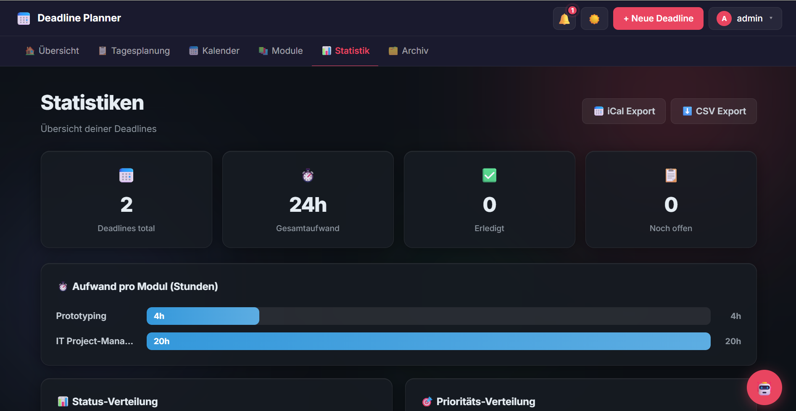

Die Statistikseite visualisiert den Fortschritt mit verschiedenen
Charts: Aufwand pro Modul als Balkendiagramm, Statusverteilung
(Offen / In Bearbeitung / Erledigt) sowie Prioritätsverteilung.
Export-Buttons ermöglichen den Download aller Deadlines als
CSV- oder iCal-Datei für den Import in externe Kalender-Apps.

> _Designentscheid:_ CSS-basierte Charts ohne externe Bibliothek
> halten die App schlank und schnell.

---

**Screen 6 – Archiv (`/archiv`)**

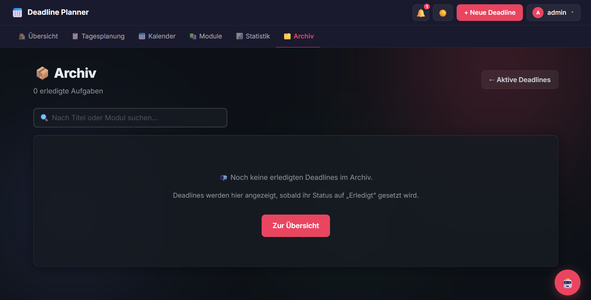

Das Archiv zeigt alle erledigten Deadlines separat, damit die
Hauptübersicht übersichtlich bleibt. Erledigte Einträge werden
automatisch ins Archiv verschoben sobald ihr Status auf
«Erledigt» gesetzt wird.

> _Designentscheid:_ Die Trennung von aktiven und erledigten
> Deadlines reduziert die visuelle Komplexität der Hauptübersicht.

---

**Screen 7 – Einstellungen (`/einstellungen`)**

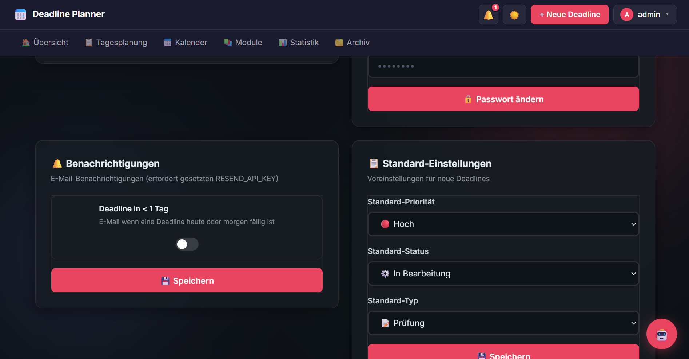

Die Einstellungsseite bietet vier Bereiche: Profil (Anzeigename,
E-Mail, Passwort ändern), Benachrichtigungen (E-Mail bei Deadline
unter 1 Tag, Standard: ausgeschaltet), Navigation anpassen
(Seiten in der Tab-Leiste ein- und ausschalten) sowie
Standard-Einstellungen für neue Deadlines (Priorität, Status, Typ).

> _Designentscheid:_ Nutzende können die Navigation nach eigenen
> Bedürfnissen konfigurieren und nur die Seiten anzeigen,
> die sie wirklich nutzen.

---

**Screen 8 – KI-Assistent (Floating Widget)**

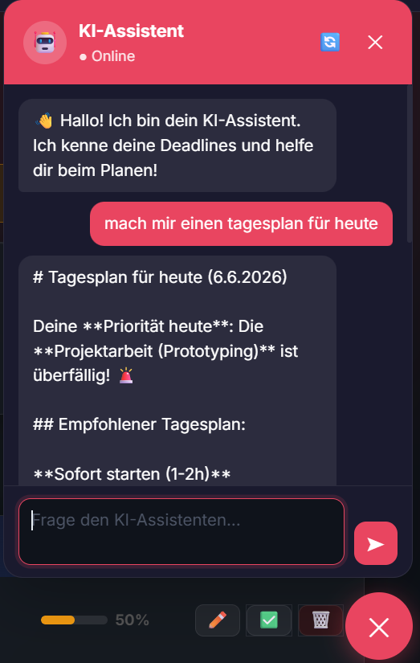

Der KI-Assistent ist als schwebendes Chat-Widget rechts unten
auf jeder Seite verfügbar. Er öffnet sich standardmässig beim
Laden der App und kann bei Bedarf geschlossen werden. Das Widget
zeigt den Chatverlauf, Schnell-Buttons für häufige Fragen
(Tagesplan, Priorität, 2h Zeit) sowie ein Texteingabefeld.
Der Assistent kennt alle aktuellen Deadlines des eingeloggten
Users und gibt personalisierte Empfehlungen für Tagesplanung
und Priorisierung. Ein «Neues Gespräch»-Button setzt den
Verlauf zurück.

> _Designentscheid:_ Das floating Widget unterbricht den
> Workflow nicht – der KI-Assistent ist jederzeit erreichbar,
> ohne eine eigene Seite aufrufen zu müssen.

---

##### Designentscheidungen

| Entscheidung                         | Beschreibung                                      | Begründung                                                   |
| ------------------------------------ | ------------------------------------------------- | ------------------------------------------------------------ |
| **Dark Mode als Standard**           | Dunkles Farbschema mit Hell/Dunkel-Toggle         | Reduziert Augenmüdigkeit bei häufiger Nutzung; moderner Look |
| **Zweistufige Navbar**               | Obere Leiste (Aktionen) + Tab-Leiste (Navigation) | Trennt Aktionen von Navigation; mehr Platz für Links         |
| **Rot/Orange/Grün als Statusfarben** | Farbkodierung nach Dringlichkeit                  | Sofortige visuelle Einschätzung ohne Lesen                   |
| **Tabellenbasiertes Layout**         | Deadlines als sortierbare Tabelle                 | Gute Scannbarkeit bei vielen Einträgen; bekanntes Muster     |
| **Floating KI-Widget**               | Chat immer verfügbar, ohne eigene Seite           | Unterbricht den Workflow nicht; jederzeit erreichbar         |
| **Flache Navigation**                | Alle Hauptseiten direkt über Tab-Leiste           | Minimale Klicktiefe; keine versteckten Unterseiten           |
| **Konfigurierbare Navbar**           | User kann Tab-Leiste anpassen                     | Personalisierung erhöht Relevanz der angezeigten Inhalte     |

#### 3.4.2. Umsetzung (Technik)

##### Technologie-Stack

| Schicht               | Technologie                      | Version | Zweck                                                     |
| --------------------- | -------------------------------- | ------- | --------------------------------------------------------- |
| **Framework**         | SvelteKit                        | 2.x     | Full-Stack Web-Framework (Routing, SSR, Form Actions)     |
| **Sprache**           | JavaScript (ES2022)              | —       | Frontend & Backend Logik                                  |
| **Datenbank**         | MongoDB Atlas                    | 7.x     | Cloud-Datenbank für User und Deadlines                    |
| **DB-Treiber**        | mongodb (Node.js)                | 6.x     | Verbindung zu MongoDB aus SvelteKit Server-Code           |
| **Authentifizierung** | bcryptjs + Cookies               | —       | Passwort-Hashing & Session-Verwaltung via httpOnly-Cookie |
| **KI-Integration**    | Anthropic API (claude-haiku-4-5) | —       | KI-Assistent mit Zugang zu User-Deadlines                 |
| **E-Mail**            | Resend API                       | —       | E-Mail-Benachrichtigungen bei kritischen Deadlines        |
| **Styling**           | Custom CSS + CSS-Variablen       | —       | Dark/Light Mode, konsistentes Design-System               |
| **Deployment**        | Netlify                          | —       | Serverless Deployment mit automatischem CI/CD             |

---

##### Tooling

| Tool                                | Einsatz                                                           |
| ----------------------------------- | ----------------------------------------------------------------- |
| **Visual Studio Code**              | Primäre Entwicklungsumgebung                                      |
| **Claude Code (VS Code Extension)** | KI-gestützte Code-Generierung, Implementierung grösserer Features |
| **GitHub Copilot**                  | Autovervollständigung im Editor                                   |
| **MongoDB Atlas**                   | Cloud-Datenbank und Verwaltungskonsole                            |
| **Git & GitHub**                    | Versionskontrolle und Repository-Verwaltung                       |
| **Netlify**                         | Deployment und Environment Variables                              |
| **Figma**                           | Mockup-Erstellung                                                 |

> Der Einsatz von KI-Werkzeugen wird im Kapitel **KI-Deklaration** detailliert beschrieben.

---

##### Struktur & Komponenten

**Projektstruktur (vereinfacht):**

```
src/
├── lib/
│   ├── db.js                        ← MongoDB-Verbindung und Datenbankoperationen
│   ├── auth.js                      ← Session-Hilfsfunktionen (getUserFromCookie)
│   ├── email.js                     ← E-Mail-Versand via Resend API
│   └── i18n.js                      ← Sprachverwaltung (Deutsch)
├── routes/
│   ├── +layout.svelte               ← Root-Layout: Navbar, Tab-Leiste, KI-Widget
│   ├── +layout.server.js            ← User + Benachrichtigungen laden
│   ├── +page.svelte                 ← Übersicht / Landingpage
│   ├── +page.server.js              ← Deadlines laden + Löschen-Action
│   ├── neu/                         ← Formular neue Deadline
│   ├── bearbeiten/[id]/             ← Deadline bearbeiten
│   ├── tagesplanung/                ← h/Tag-Berechnung
│   ├── kalender/                    ← Wochen- und Monatsansicht
│   ├── module/                      ← Modulübersicht gruppiert
│   ├── statistik/                   ← Charts und Export
│   ├── archiv/                      ← Erledigte Deadlines
│   ├── einstellungen/               ← Profil, Benachrichtigungen, Navigation
│   ├── admin/                       ← Benutzerverwaltung (nur Admin)
│   ├── login/                       ← Login & Registrierung
│   ├── logout/                      ← GET-Endpoint: Cookie löschen + Redirect
│   └── api/
│       └── chat/                    ← POST-Endpoint: Anthropic API
├── hooks.server.js                  ← Route-Schutz, User aus Cookie laden
└── app.html                         ← HTML-Template
```

**Wichtige Komponenten und Funktionen:**

- **`hooks.server.js`** – Prüft bei jedem Request den Session-Cookie; leitet nicht eingeloggte Benutzer auf `/login` um; macht User-Daten in `locals.user` verfügbar.
- **`db.js`** – Zentrales Datenbankmodul; kapselt alle MongoDB-Operationen und wird ausschliesslich in server-seitigem Code importiert.
- **`auth.js`** – Hilfsfunktion `getUserFromCookie()` zum Laden des eingeloggten Benutzers aus dem Session-Cookie.
- **`email.js`** – Sendet E-Mail-Benachrichtigungen via Resend API bei Deadlines < 1 Tag.
- **`api/chat/+server.js`** – Empfängt Chat-Nachrichten, lädt Deadlines des Users aus MongoDB, sendet Kontext + Frage an Anthropic API, gibt Antwort zurück.

**State Management:**
Der Authentifizierungsstatus wird über einen `httpOnly`-Cookie verwaltet. Der User-State wird bei jedem Request serverseitig aus MongoDB geladen und via `locals.user` an alle Seiten weitergegeben. Hell/Dunkel-Modus wird im `localStorage` gespeichert.

---

##### Daten & Schnittstellen

**Datenbankstruktur (MongoDB Collections):**

| Collection  | Inhalt            | Wichtige Felder                                                                                                                             |
| ----------- | ----------------- | ------------------------------------------------------------------------------------------------------------------------------------------- |
| `users`     | Benutzerkonten    | `username`, `email`, `password` (bcrypt-Hash), `role` (admin/user), `notificationSettings`, `navbarSettings`, `defaultSettings`, `erstellt` |
| `deadlines` | Deadline-Einträge | `titel`, `modul`, `deadline`, `aufwand`, `prioritaet`, `status`, `typ`, `fortschritt`, `notizen`, `userId`, `erstellt`                      |

**Form Actions (SvelteKit):**

| Route              | Action               | Funktion                            |
| ------------------ | -------------------- | ----------------------------------- |
| `/login`           | `default`            | Login validieren, Cookie setzen     |
| `/login`           | `registrieren`       | Neuen User erstellen, Cookie setzen |
| `/logout`          | GET                  | Cookie löschen, Redirect zu /login  |
| `/neu`             | `default`            | Neue Deadline in MongoDB speichern  |
| `/bearbeiten/[id]` | `default`            | Deadline in MongoDB aktualisieren   |
| `/`                | `loeschen`           | Deadline aus MongoDB löschen        |
| `/admin`           | `erstellen`          | Neuen User erstellen (nur Admin)    |
| `/admin`           | `loeschen`           | User löschen (nur Admin)            |
| `/einstellungen`   | `profil`             | Anzeigename und E-Mail speichern    |
| `/einstellungen`   | `benachrichtigungen` | Notification-Settings speichern     |
| `/einstellungen`   | `navigation`         | Navbar-Settings speichern           |
| `/einstellungen`   | `standards`          | Default-Einstellungen speichern     |
| `/api/chat`        | POST                 | Anthropic API aufrufen              |

---

##### Deployment

> Die Anwendung wurde lokal entwickelt und getestet (`localhost:5173`).
> Der produktive Link ist: **https://deadline-planner.netlify.app/**
>
> Deployment erfolgt über Netlify mit automatischem CI/CD: Jeder Push auf den `main`-Branch löst automatisch ein neues Deployment aus. Umgebungsvariablen (`MONGODB_URI`, `ANTHROPIC_API_KEY`, `RESEND_API_KEY`) sind in Netlify konfiguriert.

---

##### Besondere Entscheidungen

**1. Session via httpOnly-Cookie statt JWT**
Die Session wird als `httpOnly`-Cookie mit der MongoDB-User-ID gespeichert. Bei jedem Request wird der User aus der Datenbank geladen. Sicher gegenüber XSS-Angriffen; einfach implementierbar.

**2. Admin-Seeding beim Login**
Der erste Admin-User wird automatisch beim ersten Aufruf der Login-Seite erstellt, falls noch kein Admin in der Datenbank vorhanden ist. Vereinfacht das Setup erheblich.

**3. KI-Assistent mit Deadline-Kontext**
Der KI-Assistent erhält bei jedem Chat-Request die aktuellen Deadlines des Users als System-Prompt-Kontext. Dadurch kann er personalisierte Antworten geben, die auf den echten Daten des Users basieren.

**4. Logout via GET-Endpoint**
Statt einer POST Form-Action wird ein GET-Endpoint unter `/logout` verwendet. Ein einfacher `<a href="/logout">`-Link löscht den Cookie und leitet auf `/login` weiter. Dies ist zuverlässiger in verschiedenen SvelteKit-Konfigurationen.

**5. Konfigurierbare Navbar**
User können in den Einstellungen wählen, welche Seiten in der Tab-Leiste angezeigt werden. Die Auswahl wird in MongoDB gespeichert und beim Layout-Load gelesen.

---

### 3.5 Validate

**URL der getesteten Version:** https://deadline-planner.netlify.app/

#### Ziele der Prüfung

Die Evaluation soll folgende Fragen beantworten:

1. Können neue Nutzende ohne Anleitung einen Account erstellen und sich einloggen?
2. Ist die Navigation zwischen den Hauptseiten intuitiv verständlich?
3. Können Nutzende eine neue Deadline erfassen und in der Übersicht finden?
4. Verstehen Nutzende die Farbkodierung und Warnungen auf dem Dashboard?
5. Ist die Tagesplanung mit der automatischen h/Tag-Berechnung selbsterklärend?
6. Wird der KI-Assistent als hilfreich wahrgenommen?

---

#### Vorgehen

- **Methode:** Moderierter Usability-Test
- **Setting:** On-site (persönlich vor Ort)
- **Dauer pro Session:** ca. 20–30 Minuten
- **Werkzeuge:** Browser (Chrome), Beobachtungsprotokoll
- **Rolle Moderator:** Aufgaben vorlesen, keine Hilfestellung geben, Beobachtungen notieren

---

#### Stichprobe

Es wurden **2 Testpersonen** rekrutiert. Das Profil entspricht der Zielgruppe (Studierende mit mehreren Modulen parallel):

- **Testperson 1:** Student, 22 Jahre, Wirtschaftsstudium, nutzt keine Deadline-App
- **Testperson 2:** Studentin, 24 Jahre, Informatikstudium, nutzt Notion für Aufgaben

---

#### Aufgaben / Szenarien

**Aufgabe 1 – Registrierung & Login**

> «Du hörst zum ersten Mal von dieser App. Erstelle einen Account und melde dich an.»

**Aufgabe 2 – Deadline erfassen**

> «Du hast nächste Woche eine Prüfung in Mathematik mit einem geschätzten Aufwand von 8 Stunden. Trage diese Deadline in die App ein.»

**Aufgabe 3 – Tagesplanung verstehen**

> «Finde heraus, wie viele Stunden du heute für deine Deadlines arbeiten solltest.»

**Aufgabe 4 – Status aktualisieren**

> «Markiere die Mathematik-Prüfung als ‹In Bearbeitung›.»

**Aufgabe 5 – KI-Assistent nutzen**

> «Frage den KI-Assistenten, welche Deadline du heute zuerst angehen solltest.»

---

#### Kennzahlen & Beobachtungen

**Erfolgsquoten:**

| Aufgabe               | T1  | T2  | Erfolgsquote |
| --------------------- | --- | --- | ------------ |
| 1 – Registrierung     | ✅  | ✅  | 100%         |
| 2 – Deadline erfassen | ✅  | ⚠️  | 75%          |
| 3 – Tagesplanung      | ⚠️  | ⚠️  | 50%          |
| 4 – Status ändern     | ✅  | ✅  | 100%         |
| 5 – KI-Assistent      | ✅  | ⚠️  | 75%          |

> ✅ = Erfolgreich ohne Hilfe | ⚠️ = Mit Zögern oder kleinen Fehlern | ❌ = Nicht erfolgreich

**Qualitative Findings (Issue Map):**

| ID   | Seite        | Schweregrad | Beobachtung                                                                                    |
| ---- | ------------ | ----------- | ---------------------------------------------------------------------------------------------- |
| U-01 | Tagesplanung | 🟡 Mittel   | Die h/Tag-Berechnung ist nicht sofort verständlich – Testperson 1 fragte, was «h/Tag» bedeutet |
| U-02 | Neu          | 🟢 Gering   | Das Feld «Typ» wurde von beiden Testpersonen ignoriert, obwohl es nützlich wäre                |
| U-03 | Übersicht    | 🟡 Mittel   | Testperson 2 fand die Sortierung der Tabelle nicht intuitiv                                    |
| U-04 | KI-Assistent | 🟢 Gering   | Testperson 1 wusste nicht dass der KI-Assistent ihre echten Deadlines kennt                    |

> 📸 **Screenshots der Issues hier einfügen** (optional, erhöht die Qualität der Dokumentation):
>
> - `static/images/readme/issue-u01-tagesplanung.png`
> - `static/images/readme/issue-u03-tabelle.png`

---

#### Zusammenfassung der Resultate

Die Evaluation zeigt, dass die grundlegende Navigation und der Login-/Registrierungsprozess gut funktionieren und von beiden Testpersonen ohne Probleme abgeschlossen wurden. Die Tagesplanung mit der automatischen h/Tag-Berechnung wird als sehr nützlich bewertet, erfordert jedoch eine kurze Erklärung der Berechnung direkt auf der Seite. Die Farbkodierung der Deadlines wird intuitiv verstanden. Der KI-Assistent wird als hilfreich empfunden, sobald klar ist dass er die echten Deadlines kennt.

---

#### Abgeleitete Verbesserungen

| Priorität | Issue | Massnahme                                                 | Begründung                                               |
| --------- | ----- | --------------------------------------------------------- | -------------------------------------------------------- |
| 🟡 P1     | U-01  | Erklärungstext zur h/Tag-Berechnung ergänzen              | Kernfunktion der Tagesplanung muss selbsterklärend sein  |
| 🟡 P2     | U-03  | Sortierbarkeit der Tabellenspalten durch Klick auf Header | Nutzende erwarten klickbare Spaltenheader zur Sortierung |
| 🟢 P3     | U-02  | Tooltip beim Typ-Feld hinzufügen                          | Erklärt den Nutzen des Feldes ohne UI zu überladen       |
| 🟢 P4     | U-04  | Hinweistext im KI-Widget: «Ich kenne deine Deadlines»     | Erhöht das Vertrauen in die personalisierten Antworten   |

---

## 4. Erweiterungen

### 4.1 Login & Registrierung mit Rollenverwaltung

- **Beschreibung & Nutzen:** Nutzende können sich über ein Registrierungsformular einen eigenen Account erstellen. Passwörter werden mit bcryptjs gehasht. Beim Login wird ein `httpOnly`-Session-Cookie gesetzt. Es gibt zwei Rollen: `admin` (Zugang zu /admin) und `user` (eigene Deadlines). Nicht eingeloggte Nutzende werden automatisch auf `/login` weitergeleitet. Passwörter können im Login- und Registrierungsformular per Klick auf ein Auge-Symbol angezeigt werden.
- **Wo umgesetzt:**
  - **Frontend:** `src/routes/login/+page.svelte` – Login- und Registrierungsformular mit Fehleranzeige, Passwort-Toggle
  - **Backend:** `src/routes/login/+page.server.js` – Passwort-Hashing, Cookie setzen; `src/hooks.server.js` – Route-Schutz; `src/routes/logout/+server.js` – Cookie löschen
  - **Datenbank:** Collection `users` mit Feldern username, email, password (Hash), role, notificationSettings, navbarSettings, defaultSettings
- **Referenz:** Screen 8 (Login) in Kap. 3.4.1
- **Aus Evaluation abgeleitet?:** Nein – eigenständige Erweiterung

---

### 4.2 Admin-Panel – Benutzerverwaltung

- **Beschreibung & Nutzen:** Nutzende mit der Rolle `admin` erhalten Zugriff auf `/admin`. Dort können neue Benutzer mit Passwort und Rollenzuweisung erstellt und bestehende gelöscht werden. Der Admin-Link erscheint nur in der Navbar für Admin-Nutzende. Admins sehen auf allen anderen Seiten ausschliesslich ihre eigenen Deadlines – keine Daten anderer User.
- **Wo umgesetzt:**
  - **Frontend:** `src/routes/admin/+page.svelte` – Benutzertabelle, Inline-Formular
  - **Backend:** `src/routes/admin/+page.server.js` – Zugriffsschutz (role !== 'admin'), Actions `erstellen` und `loeschen`
  - **Datenbank:** MongoDB-Operationen auf Collection `users`
- **Referenz:** Screen 8 (Admin-Panel) in Kap. 3.4.1
- **Aus Evaluation abgeleitet?:** Nein – eigenständige Erweiterung

---

### 4.3 Tagesplanung / Workload-Rechner

- **Beschreibung & Nutzen:** Die Tagesplanung berechnet automatisch für jede offene Deadline, wie viele Stunden pro Tag benötigt werden (Aufwand ÷ verbleibende Tage). Die Deadlines werden nach Dringlichkeit gruppiert (Heute, Diese Woche, Später). Eine Tagesziel-Card zeigt den aggregierten Gesamtaufwand für heute.
- **Wo umgesetzt:**
  - **Frontend:** `src/routes/tagesplanung/+page.svelte` – Berechnung und Darstellung der h/Tag-Werte; Gruppierung nach Dringlichkeit
  - **Backend:** `src/routes/tagesplanung/+page.server.js` – Lädt alle offenen Deadlines des Users
- **Referenz:** Screen 4 (Tagesplanung) in Kap. 3.4.1; Issue U-01 in Kap. 3.5
- **Aus Evaluation abgeleitet?:** Teilweise – Erklärungstext als Folge von Issue U-01 ergänzt

---

### 4.4 Modulübersicht

- **Beschreibung & Nutzen:** Die Modulübersicht gruppiert alle Deadlines nach Modul und zeigt pro Modul: Anzahl Deadlines, Gesamtaufwand, erledigte vs. offene Tasks und einen Fortschrittsbalken (% erledigt). So sehen Studierende auf einen Blick, welches Fach am meisten Aufwand erfordert.
- **Wo umgesetzt:**
  - **Frontend:** `src/routes/module/+page.svelte` – Karten pro Modul mit Statistiken und Fortschrittsbalken
  - **Backend:** `src/routes/module/+page.server.js` – Aggregation nach Modul-Feld in MongoDB
- **Aus Evaluation abgeleitet?:** Nein – eigenständige Erweiterung

---

### 4.5 Statistik-Dashboard

- **Beschreibung & Nutzen:** Die Statistik-Seite visualisiert den Deadline-Überblick durch CSS-basierte Balkendiagramme (Aufwand pro Modul), Statusverteilung und Prioritätsverteilung. CSV- und iCal-Export-Buttons ermöglichen den Datenexport.
- **Wo umgesetzt:**
  - **Frontend:** `src/routes/statistik/+page.svelte` – CSS-basierte Charts ohne externe Bibliothek
  - **Backend:** `src/routes/statistik/+page.server.js` – Aggregation der Statistikdaten aus MongoDB
- **Aus Evaluation abgeleitet?:** Nein – eigenständige Erweiterung

---

### 4.6 Kalenderansicht (Woche & Monat)

- **Beschreibung & Nutzen:** Die Kalenderansicht bietet eine Wochen- und Monatsansicht. Alle 7 Tage werden angezeigt, auch leere. Navigation mit Pfeilen und «Heute»-Button. Deadlines erscheinen als farbige Badges nach Priorität. Toggle zwischen Wochen- und Monatsansicht. Auf Mobile: Wochenansicht mit horizontalem Scroll.
- **Wo umgesetzt:**
  - **Frontend:** `src/routes/kalender/+page.svelte` – CSS-Grid-basierter Kalender, reaktive Datumsnavigation, keine externe Bibliothek
  - **Backend:** `src/routes/kalender/+page.server.js` – Alle Deadlines des Users laden; Filterung clientseitig
- **Aus Evaluation abgeleitet?:** Nein – eigenständige Erweiterung

---

### 4.7 KI-Assistent (Floating Widget)

- **Beschreibung & Nutzen:** Der KI-Assistent ist als schwebendes Chat-Widget rechts unten auf jeder Seite verfügbar. Er öffnet sich standardmässig und kann geschlossen werden. Er kennt alle aktuellen Deadlines des Users und gibt personalisierte Empfehlungen für Tagesplanung und Priorisierung. Schnell-Buttons für häufige Fragen, Typing-Animation, «Neues Gespräch»-Funktion.
- **Wo umgesetzt:**
  - **Frontend:** Im Root-Layout `+layout.svelte` – Chat-Widget mit Svelte-Reaktivität; animierter Open/Close
  - **Backend:** `src/routes/api/chat/+server.js` – Lädt User-Deadlines, sendet Kontext an Anthropic API (claude-haiku-4-5), gibt Antwort zurück
  - **API:** Anthropic API, Modell claude-haiku-4-5; API-Key als Umgebungsvariable `ANTHROPIC_API_KEY`
- **Referenz:** Screen 7 (KI-Assistent) in Kap. 3.4.1
- **Aus Evaluation abgeleitet?:** Nein – eigenständige Erweiterung

---

### 4.8 Benachrichtigungs-Glocke

- **Beschreibung & Nutzen:** Die Glocke in der oberen Navbar zeigt ein rotes Badge mit der Anzahl kritischer Deadlines (< 3 Tage). Ein Klick öffnet ein Dropdown mit den dringenden Deadlines, gruppiert nach Dringlichkeit (überfällig, heute, bald). Jeder Eintrag verlinkt direkt zur Bearbeitungsseite.
- **Wo umgesetzt:**
  - **Frontend:** `+layout.svelte` – Benachrichtigungs-Dropdown mit Pulsierende-Animation bei aktivem Badge
  - **Backend:** `+layout.server.js` – Lädt Deadlines < 3 Tage beim Layout-Load
- **Aus Evaluation abgeleitet?:** Nein – eigenständige Erweiterung

---

### 4.9 E-Mail-Benachrichtigungen

- **Beschreibung & Nutzen:** User die eine E-Mail-Adresse in den Einstellungen hinterlegt und Benachrichtigungen aktiviert haben, erhalten E-Mails wenn eine Deadline in weniger als 1 Tag fällig ist. Standard: ausgeschaltet. User müssen Benachrichtigungen selbst aktivieren.
- **Wo umgesetzt:**
  - **Frontend:** Einstellungsseite – Toggle für Benachrichtigungen (Standard: aus)
  - **Backend:** `src/lib/email.js` – Resend API Integration; `src/routes/api/check-deadlines/+server.js` – Prüft Deadlines und versendet E-Mails
  - **API:** Resend API; API-Key als Umgebungsvariable `RESEND_API_KEY`
- **Aus Evaluation abgeleitet?:** Nein – eigenständige Erweiterung

---

### 4.10 Hell/Dunkel-Modus

- **Beschreibung & Nutzen:** Die gesamte Anwendung unterstützt einen Hell- und Dunkel-Modus. Der Toggle befindet sich in der oberen Navbar. Die gewählte Einstellung wird im `localStorage` gespeichert und beim nächsten Besuch wiederhergestellt. CSS-Variablen steuern alle Farben konsistent.
- **Wo umgesetzt:**
  - **Frontend:** `+layout.svelte` – Theme-Toggle mit `data-theme`-Attribut; CSS-Variablen in `:root` und `[data-theme="light"]`
- **Aus Evaluation abgeleitet?:** Nein – eigenständige Designentscheidung

---

### 4.11 Einstellungsseite

- **Beschreibung & Nutzen:** Die Einstellungsseite bietet vier Bereiche: (1) Profil – Anzeigename, E-Mail, Passwort ändern; (2) Benachrichtigungen – E-Mail bei Deadline < 1 Tag; (3) Navigation – Tab-Leiste konfigurieren; (4) Standard-Einstellungen – Vorauswahl für neue Deadlines. Alle Einstellungen werden in MongoDB gespeichert und beim Laden der Seite korrekt wiederhergestellt.
- **Wo umgesetzt:**
  - **Frontend:** `src/routes/einstellungen/+page.svelte` – vier Formularbereiche mit getrennten Actions
  - **Backend:** `src/routes/einstellungen/+page.server.js` – Actions `profil`, `benachrichtigungen`, `navigation`, `standards`; `load()` gibt gespeicherte Einstellungen zurück
  - **Datenbank:** Felder `notificationSettings`, `navbarSettings`, `defaultSettings` im User-Dokument
- **Aus Evaluation abgeleitet?:** Nein – eigenständige Erweiterung

---

### 4.12 Archiv

- **Beschreibung & Nutzen:** Erledigte Deadlines (Status = «Erledigt») werden separat im Archiv angezeigt und stören die Hauptübersicht nicht. Das Archiv ist über die Tab-Leiste erreichbar.
- **Wo umgesetzt:**
  - **Frontend:** `src/routes/archiv/+page.svelte`
  - **Backend:** `src/routes/archiv/+page.server.js` – Gefilterte Abfrage `{status: 'erledigt', userId: ...}`
- **Aus Evaluation abgeleitet?:** Nein – eigenständige Erweiterung

---

### 4.13 iCal- & CSV-Export

- **Beschreibung & Nutzen:** Alle Deadlines können als `.ics`-Datei (iCal) für Google Calendar, Apple Calendar oder Outlook exportiert werden. Zusätzlich ist ein CSV-Export möglich, der korrekt formatiert ist (Semikolon-getrennt, UTF-8 BOM für Excel).
- **Wo umgesetzt:**
  - **Backend:** `src/routes/api/export/ical/+server.js` – Generiert iCal-Datei; `src/routes/api/export/csv/+server.js` – Generiert CSV-Datei
  - **Frontend:** Export-Buttons auf der Statistikseite
- **Aus Evaluation abgeleitet?:** Nein – eigenständige Erweiterung

---

## 5. Projektorganisation

- **Repository:** [github.com/noedebelder/deadline-planner](https://github.com/noedebelder/deadline-planner) – Öffentliches GitHub-Repository mit vollständigem Sourcecode und dieser Dokumentation.

- **Struktur:** Monorepo – SvelteKit-Projekt in der Wurzel des Repositories. Sourcecode in `src/` gemäss der in Kap. 3.4.2 beschriebenen Struktur.

- **Commit-Praxis:** Commits wurden featurebezogen verfasst (z.B. _«Add login system, admin panel and improved design»_, _«Fix MongoDB connection for serverless»_, _«Add AI assistant with Claude integration»_). Jeder Commit enthält eine abgeschlossene, lauffähige Änderung.

- **Deployment:** Die App ist kontinuierlich über Netlify deployed. Jeder Push auf den `main`-Branch löst automatisch ein neues Deployment aus. Live-URL: [deadline-planner.netlify.app](https://deadline-planner.netlify.app/)

---

## 6. KI-Deklaration

### 6.1 KI-Tools

- **Eingesetzte Tools:**
  - _Claude (claude.ai / Claude Sonnet 4.6):_ Begleitung durch den gesamten Entwicklungsprozess; Setup-Anleitung, Debugging, Code-Generierung, Konzeption
  - _Claude Code (VS Code Extension, Claude Sonnet 4.6):_ Direkte Code-Generierung im Editor; Implementierung grösserer Features (Login-System, Tagesplanung, Admin-Panel, KI-Assistent, Design-Überarbeitungen)
  - _GitHub Copilot:_ Autovervollständigung bei repetitivem Code

- **Zweck & Umfang:**
  - Schritt-für-Schritt-Anleitung beim Projektsetup (SvelteKit, MongoDB, Netlify)
  - Generierung des gesamten App-Codes: Datenbankanbindung, Authentifizierungssystem, alle Routen und Seiten, API-Integrationen
  - Debugging von Build-Fehlern (Netlify-Adapter, CSS-Syntaxfehler, Cookie-Probleme)
  - Design-Entscheidungen und CSS-Implementierung (Dark/Light Mode, zweistufige Navbar, Floating Widget)
  - Erstellung dieser Projektdokumentation (README.md)
  - KI-generierter Code wurde als Ausgangsbasis verwendet und iterativ durch Prompts verfeinert

- **Eigene Leistung (Abgrenzung):**
  - Eigenständige Konzeption der Applikationsidee (Deadline Planner) und Definition der Anforderungen
  - Problemraumanalyse, Personas und HMW-Fragen
  - Entscheidungen zu Features, Design und User Experience
  - Figma-Mockup erstellt
  - Testing der App im Browser und Identifikation von Problemen
  - Durchführung und Auswertung des Usability-Tests
  - Finale Überarbeitung und Qualitätssicherung aller Inhalte

---

### 6.2 Prompt-Vorgehen

Beim Einsatz von KI-Tools wurde grundsätzlich mit kontextbezogenen, detaillierten Prompts gearbeitet. Der bestehende Code wurde als Ausgangslage mitgeliefert, damit die KI konsistente Vorschläge machen konnte.

Die Entwicklung erfolgte in mehreren Iterationen:

1. **Setup-Phase:** Schritt-für-Schritt-Prompts für SvelteKit-Setup, MongoDB-Verbindung, Netlify-Konfiguration
2. **Feature-Phase:** Grössere Feature-Prompts mit konkreten technischen Anforderungen (z.B. _«Implementiere ein vollständiges Login-System mit bcryptjs, Session-Cookies und Route-Schutz in hooks.server.js»_)
3. **Design-Phase:** Design-Prompts mit spezifischen CSS-Anforderungen (zweistufige Navbar, Glassmorphism, Dark/Light Mode)
4. **Claude Code-Phase:** Umfangreiche Prompts für Claude Code in VS Code mit vollständiger Anforderungsliste für mehrere Features gleichzeitig
5. **Debugging-Phase:** Gezielte Diagnose-Prompts wenn Features nicht funktionierten (z.B. Logout, Settings-Persistenz)

Beispiel-Prompt (Claude Code): _«Implementiere die Einstellungsseite mit vier getrennten Form-Actions (profil, benachrichtigungen, navigation, standards). Beim Laden der Seite sollen die gespeicherten Werte aus MongoDB korrekt vorausgefüllt werden. Nach dem Speichern soll throw redirect(303, '/einstellungen') den aktuellen Stand anzeigen.»_

---

### 6.3 Reflexion

**Nutzen:** Der Einsatz von KI hat die Entwicklung erheblich beschleunigt. Besonders beim Setup komplexer Systeme (Authentifizierung, MongoDB-Integration, Anthropic API, Resend) hat die schrittweise Begleitung Zeit gespart und Fehler frühzeitig identifiziert. Claude Code ermöglichte die Implementierung mehrerer Features gleichzeitig in kurzer Zeit.

**Grenzen:** KI-generierter Code muss stets auf Korrektheit und Kompatibilität geprüft werden. Vereinzelt wurden veraltete SvelteKit-Syntaxen oder CSS-Fehler produziert, die manuell korrigiert werden mussten. Komplexe Debugging-Situationen (z.B. Netlify Build-Fehler, Cookie-Persistenz) erforderten mehrere Iterationen und eigenes Verständnis der Technologie.

**Risiken & Qualitätssicherung:**

- Alle KI-Vorschläge wurden lokal mit `npm run dev` und `npm run build` getestet
- Datenbankoperationen wurden in MongoDB Atlas auf Korrektheit geprüft
- Die deployete App wurde nach jedem Push in Netlify getestet
- Sicherheitskritische Aspekte (Passwort-Hashing, Session-Cookie, Route-Schutz) wurden eigenständig auf Korrektheit geprüft

---

## 7. Anhang

- **Live-App:** https://deadline-planner.netlify.app/
- **GitHub-Repository:** https://github.com/noedebelder/deadline-planner
- **Figma-Mockup:** https://www.figma.com/design/LEyjt3Ir9PwxXuDjK9TyFG/Deadline-Planner-Mockup?node-id=0-1&p=f&t=h5NKSlflyNY1SQ3w-0

### Screenshots-Anleitung

Erstelle den Ordner `static/images/readme/` in deinem Projekt und füge folgende Screenshots ein:

| Dateiname           | Was soll zu sehen sein                                      |
| ------------------- | ----------------------------------------------------------- |
| `landingpage.png`   | Landingpage mit Hero und Feature-Preview (nicht eingeloggt) |
| `uebersicht.png`    | Dashboard mit Statistik-Karten und Deadline-Tabelle         |
| `neue-deadline.png` | Formular zum Erfassen einer Deadline                        |
| `tagesplanung.png`  | Tagesplanung mit h/Tag-Berechnung                           |
| `kalender.png`      | Kalenderansicht (Woche oder Monat)                          |
| `statistik.png`     | Statistikseite mit Charts                                   |
| `ki-assistent.png`  | Geöffnetes KI-Chat-Widget mit Beispielkonversation          |
| `admin.png`         | Admin-Panel mit Benutzertabelle                             |
| `einstellungen.png` | Einstellungsseite                                           |
| `skizze.png`        | Handskizzen aus dem Sketch-Schritt                          |
| `workflow.png`      | Workflow-Diagramm (optional)                                |
